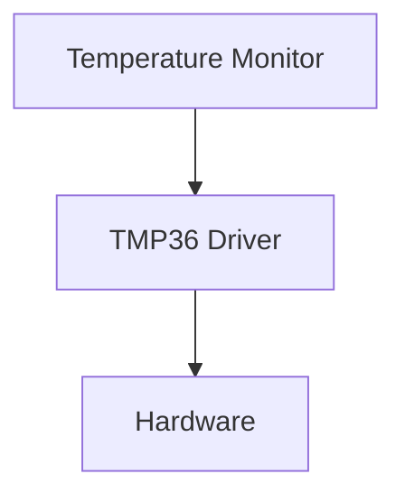
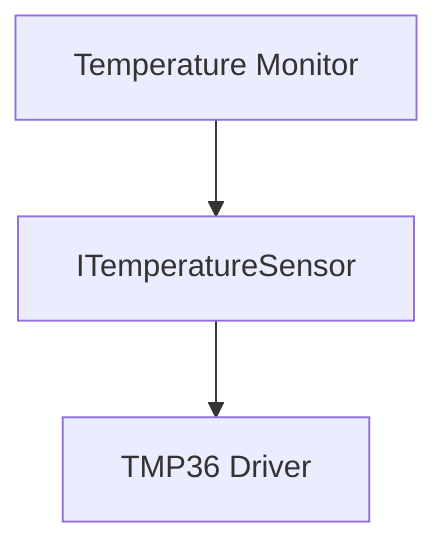

# Hardware Abstraction Layer (HAL)
## Contents

- [Real Problem](#real-problem)
- [Why It Happens](#why-it-happens)
- [Architecture Solution](#architecture-solution)
- [UML Diagram](#uml-diagram)
- [CPP EXAMPLE](#cpp-example)
- [Benefits](#benefits)
- [Tradeoffs](#tradeoffs)
   
---

## Real Problem

### Problem Description

Imagine we are developing a **Temperature Monitoring Device**.

The device has three main responsibilities:

- Read temperature from a sensor
- Display temperature to the operator
- Send temperature measurements to a supervisory system

Initially, the system uses a **TMP36 temperature sensor**. The application directly communicates with the TMP36 driver to obtain temperature readings.

### Initial Design



At first glance, this design looks simple and works correctly.

However, after deployment, several situations may occur:

- TMP36 sensor becomes obsolete
- Customer requests a different sensor
- New hardware platform is selected
- Software team wants to perform unit testing on a PC
- Engineers want to simulate sensor failures
- Production team finds a hardware-related bug

### Example Scenario

Assume the monitoring application contains code like this:

```cpp
float temperature = tmp36Driver.readTemperature();
```
A year later, marketing decides to replace TMP36 with a digital sensor such as TMP117.

Now every module that directly uses `tmp36Driver` must be modified and retested.

Even a small hardware change can create:

- Additional development effort
- Higher regression testing cost
- Increased risk of software defects
- Longer release cycles

### Impact on Reliability

Direct hardware dependency reduces system reliability because:

#### 1. Difficult Fault Injection

It becomes hard to simulate:

- Sensor disconnection
- Invalid readings
- Noise
- Hardware failures

Without simulation capability, many failure scenarios remain untested.

#### 2. Limited Unit Testing

Application code cannot easily run without actual hardware.

Developers often need:

- Evaluation boards
- Hardware setups
- Real sensors

for even basic testing.

#### 3. High Change Impact

A sensor replacement may force changes across multiple software modules.

More modified code means:

- More regression testing
- Higher defect probability
- Lower maintainability

#### 4. Tight Coupling

Application logic becomes tightly coupled to the hardware implementation.

When one side changes, the other side is often affected.

### Reliability Risk Summary

| Risk | Effect |
|--------|----------|
| Sensor replacement | Application modifications required |
| New MCU platform | Driver and application updates |
| Hardware fault simulation | Difficult |
| Unit testing | Hardware dependent |
| Maintenance effort | High |
| Regression risk | High |


## Why It Happens 

### Root Cause

The problem occurs because the application depends directly on a specific hardware implementation.

In our example, the `TemperatureMonitor` communicates directly with the `TMP36 Driver`.


The application knows exactly:

- Which sensor is being used
- Which driver is being used
- How the hardware is accessed

This creates a strong dependency between the application and the hardware.

This problem is what motivates the introduction of a **Hardware Abstraction Layer (HAL)**.

## Architecture Solution 🏛️

### Solution Overview

The root cause of the problem is that the application depends directly on a specific hardware driver.

```text
TemperatureMonitor
        |
        v
    TMP36 Driver
        |
        v
     Hardware
```

As a result:

- Hardware changes affect application code.
- Unit testing becomes difficult.
- Fault simulation becomes difficult.
- Software reuse is limited.

To solve this problem, we introduce a **Hardware Abstraction Layer (HAL)**.

---

### What Is a Hardware Abstraction Layer (HAL)?

A Hardware Abstraction Layer (HAL) is a software layer that sits between:

- Application logic
- Hardware-specific drivers

The application communicates with an abstraction instead of a concrete driver.

```text
Application
     |
     v
     HAL
     |
     v
Hardware Driver
     |
     v
 Hardware
```

This separation prevents hardware details from leaking into the application layer.

---

### Applying HAL to Our Temperature Monitoring Device

Instead of directly using the `TMP36Driver`, the application depends on an interface called `ITemperatureSensor`.



The application no longer knows anything about:

- TMP36
- TMP117
- ADC implementation
- MCU registers

The application only knows:

> "I need a temperature value."

---

### Introducing an Interface

The HAL can be represented by an interface:

```cpp
class ITemperatureSensor
{
public:
    virtual float readTemperature() = 0;
    virtual ~ITemperatureSensor() = default;
};
```

This interface defines **what** the application needs.

It does not define **how** the temperature is obtained.

---

### Hardware-Specific Drivers Implement the Interface

The actual driver provides the implementation.

```cpp
class TMP36Driver : public ITemperatureSensor
{
public:
    float readTemperature() override;
};
```

Future sensors can also implement the same interface.

```cpp
class TMP117Driver : public ITemperatureSensor
{
public:
    float readTemperature() override;
};
```

Both drivers provide the same functionality to the application.

---

### Dependency Direction Changes

Before HAL:

```text
TemperatureMonitor
        |
        v
    TMP36 Driver
```

After HAL:

```text
TemperatureMonitor
        |
        v
ITemperatureSensor
        ^
        |
  TMP36 Driver
```

This is an important architectural improvement.

The application now depends on an abstraction rather than a concrete implementation.

---

### Testing Becomes Easier

A mock implementation can be created for unit testing.

```cpp
class MockTemperatureSensor : public ITemperatureSensor
{
public:
    float readTemperature() override
    {
        return 95.0f;
    }
};
```

Now application logic can be tested without:

- Real hardware
- Development boards
- Physical sensors

This significantly improves testability.

---

### Sensor Replacement Becomes Simpler

Suppose the TMP36 sensor is replaced by a TMP117.

Without HAL:

```text
Application changes
        +
Driver changes
```

With HAL:

```text
Application unchanged
        +
Driver changes
```

Only the hardware-specific implementation needs modification.

The business logic remains untouched.

---

### Fault Simulation Becomes Possible

Mock implementations can simulate:

- Sensor failures
- Invalid measurements
- Extreme temperatures
- Communication errors
- Timeout conditions

This allows reliability scenarios to be tested long before hardware is available.

---

### How HAL Improves Reliability

The HAL pattern improves reliability by:

- Reducing coupling between software and hardware
- Simplifying hardware replacement
- Supporting fault injection testing
- Enabling unit testing without hardware
- Isolating hardware-specific changes
- Increasing code reuse across projects

---

### Key Takeaway

The Hardware Abstraction Layer (HAL) separates application logic from hardware-specific implementation details.

Instead of depending on a concrete driver such as `TMP36Driver`, the application depends on an abstraction (`ITemperatureSensor`).

This simple architectural change makes the system:

- More maintainable
- More testable
- More reusable
- More resilient to hardware changes

In the next section, we will visualize this design using a UML Class Diagram.
