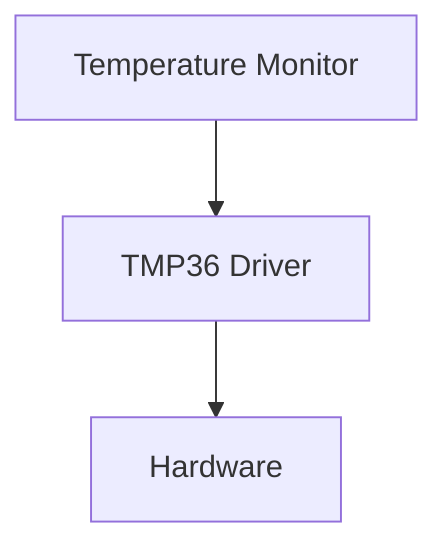

# Hardware Abstraction Layer (HAL)

## 1. Real Problem 🚨

## 2. Why It Happens 🔍

## 3. Architecture Solution 🏛️

## 4. UML Diagram 📐

## 5. C++ Example 💻

## 6. Benefits ✅

## 7. Trade-offs ⚖️

## 1. Real Problem 🚨

### Problem Description

Imagine we are developing a **Temperature Monitoring Device**.

The device has three main responsibilities:

- Read temperature from a sensor
- Display temperature to the operator
- Send temperature measurements to a supervisory system

Initially, the system uses a **TMP36 temperature sensor**. The application directly communicates with the TMP36 driver to obtain temperature readings.

### Initial Design

### Initial Design



At first glance, this design looks simple and works correctly.

However, after deployment, several situations may occur:

- TMP36 sensor becomes obsolete
- Customer requests a different sensor
- New hardware platform is selected
- Software team wants to perform unit testing on a PC
- Engineers want to simulate sensor failures
- Production team finds a hardware-related bug

## Example Scenario

Assume the monitoring application contains code like this:

```cpp
float temperature = tmp36Driver.readTemperature();
```
A year later, marketing decides to replace TMP36 with a digital sensor such as TMP117.

Now every module that directly uses `tmp36Driver` must be modified and retested.

Even a small hardware change can create:

- Additional development effort
- Higher regression testing cost
- Increased risk of software defects
- Longer release cycles

## Impact on Reliability

Direct hardware dependency reduces system reliability because:

### 1. Difficult Fault Injection

It becomes hard to simulate:

- Sensor disconnection
- Invalid readings
- Noise
- Hardware failures

Without simulation capability, many failure scenarios remain untested.

### 2. Limited Unit Testing

Application code cannot easily run without actual hardware.

Developers often need:

- Evaluation boards
- Hardware setups
- Real sensors

for even basic testing.

### 3. High Change Impact

A sensor replacement may force changes across multiple software modules.

More modified code means:

- More regression testing
- Higher defect probability
- Lower maintainability

### 4. Tight Coupling

Application logic becomes tightly coupled to the hardware implementation.

When one side changes, the other side is often affected.

## Reliability Risk Summary
