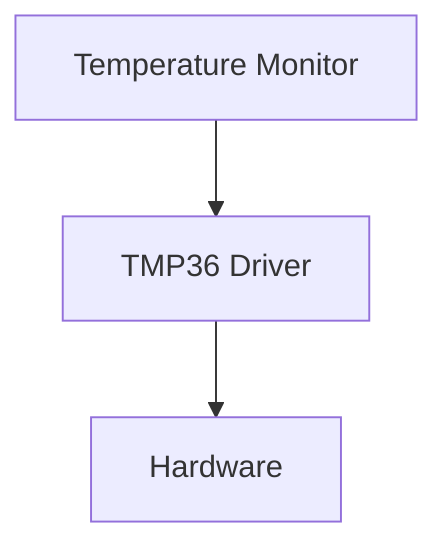

# Hardware Abstraction Layer (HAL)
## Real Problem 🚨
## Why It Happens 🔍
## Architecture Solution 🏛️
## UML Diagram 📐
## C++ Example 💻
## Benefits ✅
## Trade-offs ⚖️
  
---

## 1. Real Problem 🚨

### Problem Description

Imagine we are developing a **Temperature Monitoring Device**.

The device has three main responsibilities:

- Read temperature from a sensor
- Display temperature to the operator
- Send temperature measurements to a supervisory system

Initially, the system uses a **TMP36 temperature sensor**. The application directly communicates with the TMP36 driver to obtain temperature readings.

### Initial Design



At first glance, this design looks simple and works correctly.

However, after deployment, several situations may occur:

- TMP36 sensor becomes obsolete
- Customer requests a different sensor
- New hardware platform is selected
- Software team wants to perform unit testing on a PC
- Engineers want to simulate sensor failures
- Production team finds a hardware-related bug

## Example Scenario

Assume the monitoring application contains code like this:

```cpp
float temperature = tmp36Driver.readTemperature();
```
A year later, marketing decides to replace TMP36 with a digital sensor such as TMP117.

Now every module that directly uses `tmp36Driver` must be modified and retested.

Even a small hardware change can create:

- Additional development effort
- Higher regression testing cost
- Increased risk of software defects
- Longer release cycles

## Impact on Reliability

Direct hardware dependency reduces system reliability because:

### 1. Difficult Fault Injection

It becomes hard to simulate:

- Sensor disconnection
- Invalid readings
- Noise
- Hardware failures

Without simulation capability, many failure scenarios remain untested.

### 2. Limited Unit Testing

Application code cannot easily run without actual hardware.

Developers often need:

- Evaluation boards
- Hardware setups
- Real sensors

for even basic testing.

### 3. High Change Impact

A sensor replacement may force changes across multiple software modules.

More modified code means:

- More regression testing
- Higher defect probability
- Lower maintainability

### 4. Tight Coupling

Application logic becomes tightly coupled to the hardware implementation.

When one side changes, the other side is often affected.

## Reliability Risk Summary

| Risk | Effect |
|--------|----------|
| Sensor replacement | Application modifications required |
| New MCU platform | Driver and application updates |
| Hardware fault simulation | Difficult |
| Unit testing | Hardware dependent |
| Maintenance effort | High |
| Regression risk | High |

## Key Takeaway

The real problem is not reading the temperature sensor.

## 2. Why It Happens 🔍

### Root Cause

The problem occurs because the application depends directly on a specific hardware implementation.

In our example, the `TemperatureMonitor` communicates directly with the `TMP36 Driver`.

```text
TemperatureMonitor
        |
        v
    TMP36 Driver
        |
        v
     Hardware
```

The application knows exactly:

- Which sensor is being used
- Which driver is being used
- How the hardware is accessed

This creates a strong dependency between the application and the hardware.

---

### What Is Tight Coupling?

Two software components are said to be **tightly coupled** when a change in one component forces changes in another.

For example:

```cpp
TMP36Driver sensor;
float temperature = sensor.readTemperature();
```

The application directly depends on the `TMP36Driver` class.

If the sensor changes:

```cpp
TMP117Driver sensor;
float temperature = sensor.readTemperature();
```

the application must also change.

In other words:

> A hardware change becomes an application change.

---

### Why Is This a Problem?

Embedded systems often evolve over time.

Typical changes include:

- New sensor selection
- New microcontroller platform
- Driver updates
- Vendor component replacement
- Hardware fault simulation
- Unit testing on a PC

When the application depends directly on hardware drivers, each of these changes can affect business logic.

---

### Dependency Direction

A common architecture mistake is shown below:

```text
Application
     |
     v
Hardware Driver
     |
     v
Hardware
```

In this design:

- The application knows hardware details.
- The application cannot run without hardware.
- Hardware changes can affect application code.

This creates maintenance challenges as the project grows.

---

### Testing Becomes Difficult

Suppose we want to test the following logic:

```cpp
if (temperature > 80.0f)
{
    triggerAlarm();
}
```

To test this behavior, we first need:

- A target board
- A sensor
- A working hardware setup

Even though we only want to test application logic.

This makes testing:

- Slower
- More expensive
- More difficult to automate

---

### Fault Simulation Becomes Difficult

Reliability testing often requires simulation of failure scenarios.

For example:

- Sensor disconnected
- Invalid temperature values
- Communication timeout
- Hardware malfunction

When the application is tightly coupled to real hardware, creating these scenarios becomes difficult.

As a result, important failure paths may never be tested.

---

### Violating the Separation of Concerns Principle

Each software layer should have a clear responsibility.

Ideally:

| Layer | Responsibility |
|---------|---------------|
| Application | Business logic |
| Driver | Hardware communication |
| Hardware | Physical device |

In a tightly coupled design, the application becomes aware of hardware details.

As responsibilities start to overlap:

- Code becomes harder to understand.
- Maintenance effort increases.
- Reuse becomes difficult.

---

### Architectural Observation

The application does not actually care:

- Which sensor is used
- Which driver is used
- Which MCU is used

The application only needs one thing:

```text
Give me the current temperature.
```

However, because it depends directly on a specific driver, it becomes tied to implementation details that should not matter to business logic.

---

### Key Takeaway

The problem happens because the application depends on a **concrete hardware implementation** instead of depending on a **stable abstraction**.

This creates:

- Tight coupling
- Difficult testing
- Difficult fault simulation
- High maintenance effort
- Reduced software reuse

The next section introduces the **Hardware Abstraction Layer (HAL)**, which solves this problem by separating application logic from hardware-specific implementation details.

The real problem is that **business logic becomes dependent on a specific hardware implementation**. As the product evolves, hardware changes become expensive, testing becomes difficult, and overall system reliability decreases.

This problem is what motivates the introduction of a **Hardware Abstraction Layer (HAL)**.
