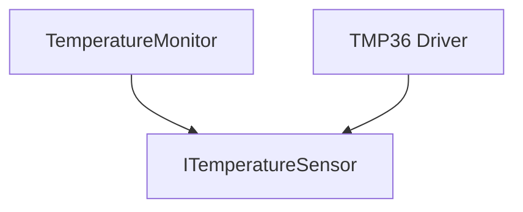

# Hardware Abstraction Layer (HAL)
## Contents

- [Real Problem](#real-problem)
- [Why It Happens](#why-it-happens)
- [Architecture Solution](#architecture-solution)
- [UML Diagram](#uml-diagram)
- [CPP EXAMPLE](#cpp-example)
- [Benefits](#benefits)
- [Tradeoffs](#tradeoffs)
   
---

## Real Problem

### Problem Description

In the previous design, we introduced a **Hardware Abstraction Layer (HAL)** to isolate the `TemperatureMonitor` from the concrete temperature sensor.

Our architecture now looks approximately like this:


This solved an important architectural problem:

The application no longer depends directly on a specific sensor implementation.

But abstraction does not make hardware failures disappear.

Consider our **industrial temperature monitoring device**.

The system periodically:

- Reads the temperature sensor
- Processes the measurement
- Displays the temperature to the operator
- Reports the measurement to a supervisory system

During normal operation, a sensor read might occasionally fail.

For example:

```text
Read #1 → Communication Timeout
Read #2 → 42.3 °C
Read #3 → 42.4 °C
```

The first operation failed, but the sensor itself was not permanently broken.

The failure was **transient**.

Possible causes include:

- Temporary communication timeout
- Bus contention
- Electrical noise
- Sensor temporarily busy
- Short-lived communication disturbance

This creates an important architecture question:

> **Should one failed sensor read immediately put the entire monitoring system into an error state?**

Usually, not necessarily.

But blindly retrying is not a good solution either.

### Two Naive Reactions

When an operation fails, two simple implementations are common.

#### Reaction 1 - Fail Immediately

```cpp
auto result = sensor.readTemperature();

if (!result.success)
{
    enterSystemError();
}
```

The architecture effectively behaves like this:

```text
Read
  |
  ▼
Fail
  |
  ▼
System Error
```

This is simple and deterministic.

However, a temporary communication disturbance can now cause an unnecessary system-level failure.

A recoverable fault has been treated as a permanent fault.

#### Reaction 2 - Retry Forever

Another implementation may attempt to recover indefinitely:

```cpp
while (!sensor.readTemperature().success)
{
    // keep trying
}
```

Now the system behaves like:

```text
Read
  |
Fail
  |
Retry
  |
Fail
  |
Retry
  |
...
```

This creates a different reliability problem.

The software may remain stuck trying to communicate with a sensor that has actually failed.

Depending on the system architecture, this can:

- Block useful work
- Increase response latency
- Prevent higher-level fault handling
- Delay fault reporting
- Interfere with timing requirements

Neither extreme distinguishes between a **transient failure** and a **persistent failure**.

## Why It Happens

### Root Cause

The architectural problem is not simply:

> “The sensor read failed.”

Failures are expected in real embedded systems.

The deeper problem is:

> **The system has no explicit recovery policy for a failed operation.**

The sensor driver knows how to communicate with the hardware.

For example:

```cpp
sensor.readTemperature();
```

But several decisions remain unanswered:

```text
What should happen if it fails?
        |
        v
Should we retry?
        |
        v
Which failures are retryable?
        |
        v
How many attempts are allowed?
        |
        v
How long should we wait?
        |
        v
What happens when recovery fails?
```
These are not merely driver implementation details.

They are **reliability-policy decisions**.


### Transient vs Persistent Failure

## Architecture Solution 

### Introduce a Bounded Retry Policy
### Retry Should Be Selective
### Where Should Retry Live? 
### Retry Must Be Bounded  
### Retry Has a Timing Cost

## UML Diagram 

### Purpose of the Diagram
### UML Class Diagram
### Diagram Explanation


## CPP EXAMPLE
### Goal


## Benefits 

## Tradeoffs 

### Trade-off Summary

### Key Takeaway

