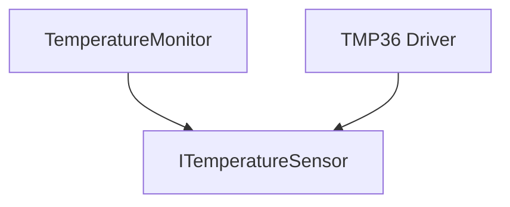
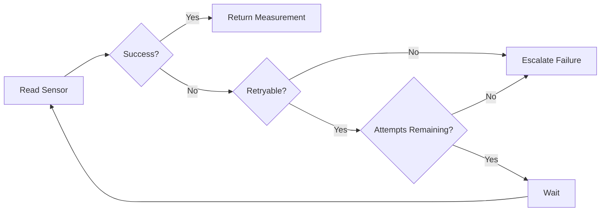
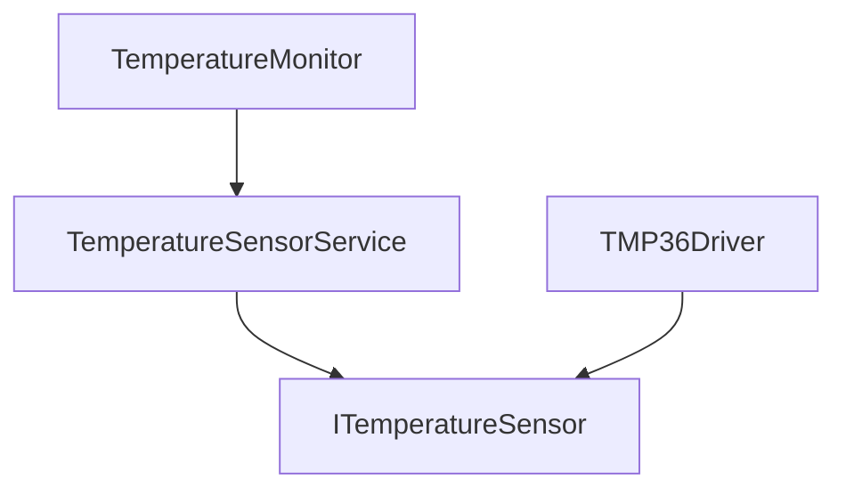

# Retry Mechanism
## Contents

- [Real Problem](#real-problem)
- [Why It Happens](#why-it-happens)
- [Architecture Solution](#architecture-solution)
- [UML Diagram](#uml-diagram)
- [CPP EXAMPLE](#cpp-example)
- [Benefits](#benefits)
- [Tradeoffs](#tradeoffs)
   
---

## Real Problem

### Problem Description

In the previous design, we introduced a **Hardware Abstraction Layer (HAL)** to isolate the `TemperatureMonitor` from the concrete temperature sensor.

Our architecture now looks approximately like this:


This solved an important architectural problem:

The application no longer depends directly on a specific sensor implementation.

But abstraction does not make hardware failures disappear.

Consider our **industrial temperature monitoring device**.

The system periodically:

- Reads the temperature sensor
- Processes the measurement
- Displays the temperature to the operator
- Reports the measurement to a supervisory system

During normal operation, a sensor read might occasionally fail.

For example:

```text
Read #1 → Communication Timeout
Read #2 → 42.3 °C
Read #3 → 42.4 °C
```

The first operation failed, but the sensor itself was not permanently broken.

The failure was **transient**.

Possible causes include:

- Temporary communication timeout
- Bus contention
- Electrical noise
- Sensor temporarily busy
- Short-lived communication disturbance

This creates an important architecture question:

> **Should one failed sensor read immediately put the entire monitoring system into an error state?**

Usually, not necessarily.

But blindly retrying is not a good solution either.

### Two Naive Reactions

When an operation fails, two simple implementations are common.

#### Reaction 1 - Fail Immediately

```cpp
auto result = sensor.readTemperature();

if (!result.success)
{
    enterSystemError();
}
```

The architecture effectively behaves like this:

```text
Read
  |
  ▼
Fail
  |
  ▼
System Error
```

This is simple and deterministic.

However, a temporary communication disturbance can now cause an unnecessary system-level failure.

A recoverable fault has been treated as a permanent fault.

#### Reaction 2 - Retry Forever

Another implementation may attempt to recover indefinitely:

```cpp
while (!sensor.readTemperature().success)
{
    // keep trying
}
```

Now the system behaves like:

```text
Read
  |
Fail
  |
Retry
  |
Fail
  |
Retry
  |
...
```

This creates a different reliability problem.

The software may remain stuck trying to communicate with a sensor that has actually failed.

Depending on the system architecture, this can:

- Block useful work
- Increase response latency
- Prevent higher-level fault handling
- Delay fault reporting
- Interfere with timing requirements

Neither extreme distinguishes between a **transient failure** and a **persistent failure**.

## Why It Happens

### Root Cause

The architectural problem is not simply:

> “The sensor read failed.”

Failures are expected in real embedded systems.

The deeper problem is:

> **The system has no explicit recovery policy for a failed operation.**

The sensor driver knows how to communicate with the hardware.

For example:

```cpp
sensor.readTemperature();
```

But several decisions remain unanswered:

```text
What should happen if it fails?
        |
        v
Should we retry?
        |
        v
Which failures are retryable?
        |
        v
How many attempts are allowed?
        |
        v
How long should we wait?
        |
        v
What happens when recovery fails?
```
These are not merely driver implementation details.

They are **reliability-policy decisions**.

### Transient vs Persistent Failure

A key architectural distinction is whether the failure has a reasonable chance of disappearing when the operation is attempted again.

#### Transient Failure

Example:

```text
Attempt 1 → Sensor disconnected
Attempt 2 → Sensor disconnected
Attempt 3 → Sensor disconnected
```
Additional retries do not repair the underlying fault.

This means:
> **Retry should only be applied when another attempt has a reasonable possibility of succeeding.**

This is why simply surrounding every failed operation with a retry loop is not a robust architecture.

## Architecture Solution 

### Introduce a Bounded Retry Policy

Instead of immediately failing or retrying forever, introduce an explicit bounded retry policy.

The recovery flow becomes:


The retry mechanism now makes several decisions explicitly:
1.	**Is this failure retryable?** 
2.	**How many attempts are allowed?** 
3.	**How long should the system wait between attempts?** 
4.	**What happens when all attempts fail?** 
This turns retry from an accidental loop into a deliberate reliability policy.

### Retry Should Be Selective

Not every error should trigger another attempt.

Consider:

```text
Communication timeout      → Retry may help
Sensor busy                → Retry may help
Temporary bus contention   → Retry may help

Invalid configuration      → Retry probably won't help
Unsupported command        → Retry won't help
Sensor disconnected        → Repeated immediate retries may not help
```
The exact classification depends on the device and its failure model.
Therefore, the retry mechanism needs meaningful error information from the lower layer.
Instead of an interface that can only return a temperature value:

```cpp
float readTemperature();
```
the design should communicate whether the operation succeeded and, when it failed, why it failed.

For example:

```cpp
enum class SensorError
{
    None,
    Timeout,
    Busy,
    CommunicationError,
    InvalidData,
    HardwareFault
};
```
This enables the recovery layer to make an explicit decision instead of treating every failure identically.

### Where Should Retry Live? 

Retry sits in a **Sensor Service + Retry** component between `TemperatureMonitor` and `ITemperatureSensor`.


Responsibilities become:

| Component | Responsibility |
|---|---|
| `TemperatureMonitor` | Application/business behavior |
| `TemperatureSensorService` | Recovery and retry policy |
| `ITemperatureSensor` | Hardware abstraction |
| `TMP36Driver` | Hardware-specific communication |

This separation is important.

We do **not** want code such as this spread throughout application logic:

```cpp
if (sensor.readTemperature() fails)
{
    delay();
    retry();
}
```
Otherwise every application component may invent its own recovery behavior.
Instead:

```text
TemperatureMonitor
        |
        ▼
TemperatureSensorService
        |
    Retry Policy
        |
        ▼
ITemperatureSensor
        ▲
        |
    TMP36Driver
```
The application asks for a temperature measurement.
The sensor service decides how temporary failures should be handled.

### Retry Must Be Bounded 

A reliable retry policy needs an upper limit.
For example:

```text
Maximum attempts: 3
Delay:            10 ms
```

Execution might look like:

```text
Attempt 1
   |
Timeout
   |
Wait 10 ms
   |
Attempt 2
   |
Timeout
   |
Wait 10 ms
   |
Attempt 3
   |
Success
   ▼
Return measurement
```

But if all attempts fail:

```text
Attempt 1 → Fail
Attempt 2 → Fail
Attempt 3 → Fail
              |
              ▼
        Retry exhausted
              |
              ▼
     Escalate the failure
```

The important principle is:

> **Retry is recovery, not fault suppression.**

Once the recovery budget has been exhausted, the failure must become visible to the next architectural level.

### Retry Has a Timing Cost

This deserves particular attention in embedded systems.

Suppose:

```text
Sensor timeout = 20 ms
Retry delay    = 10 ms
Attempts       = 3
```
A failing sensor operation can now consume roughly:

```text
20 ms + 10 ms + 20 ms + 10 ms + 20 ms
= 80 ms
```

So increasing the retry count may improve tolerance to transient faults while simultaneously degrading **timing performance**.

That connects two of the quality attributes in this series:

```text
More retries
    |
    ├──► potentially better Reliability
    |
    └──► potentially worse Latency / Performance
```

Therefore:

> **The retry budget must fit inside the system's timing budget.**

This is exactly the kind of trade-off we want your GitHub repository to teach: the architecture decision is not simply *"use Retry."* It is *"how much recovery can this system safely afford?"*

---

## Key Architecture Principle

A well-designed retry mechanism should be:

**Selective → Bounded → Observable → Escalated**

**Selective:** retry only failures that may be


## UML Diagram 

### Purpose of the Diagram
### UML Class Diagram
### Diagram Explanation


## CPP EXAMPLE
### Goal


## Benefits 

## Tradeoffs 

### Trade-off Summary

### Key Takeaway

