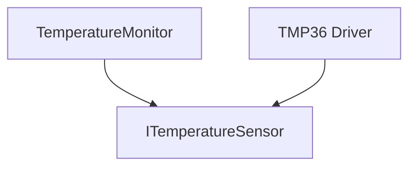
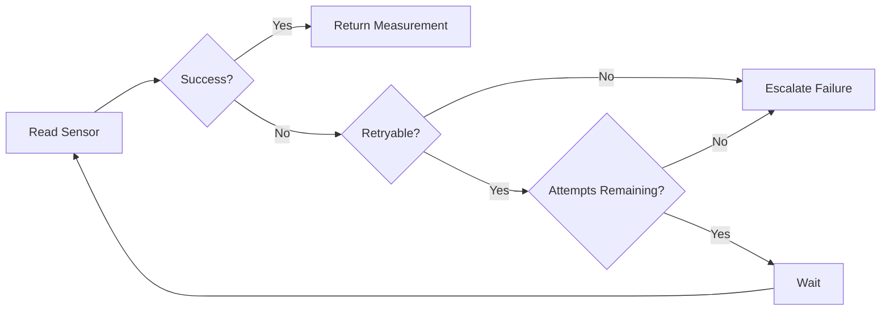
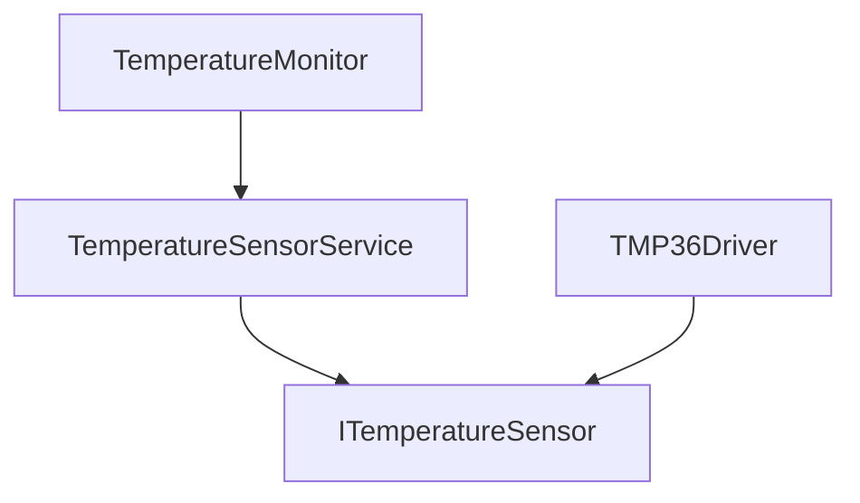
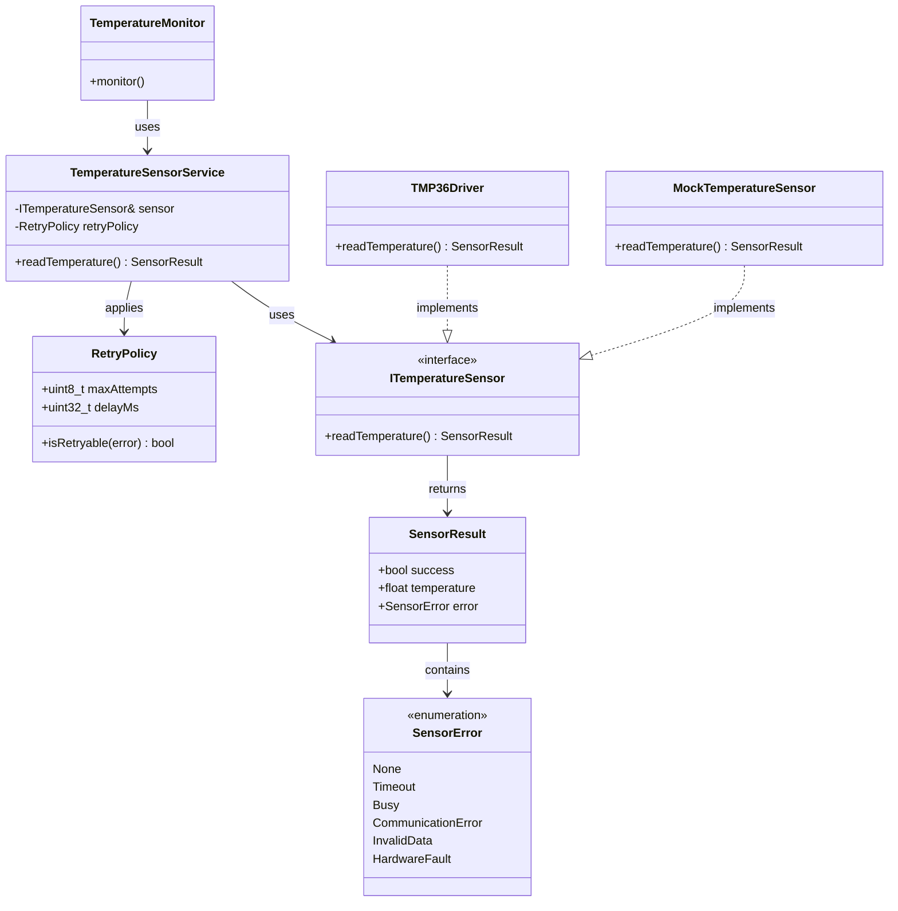
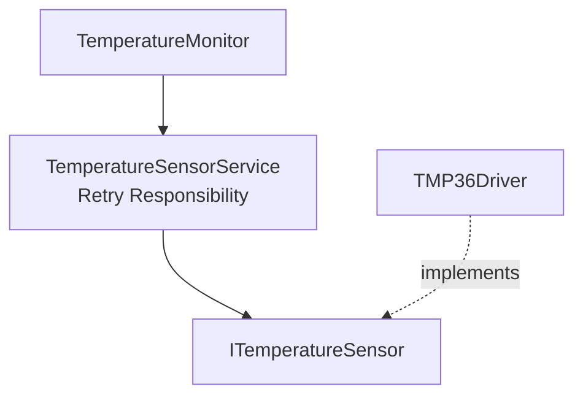
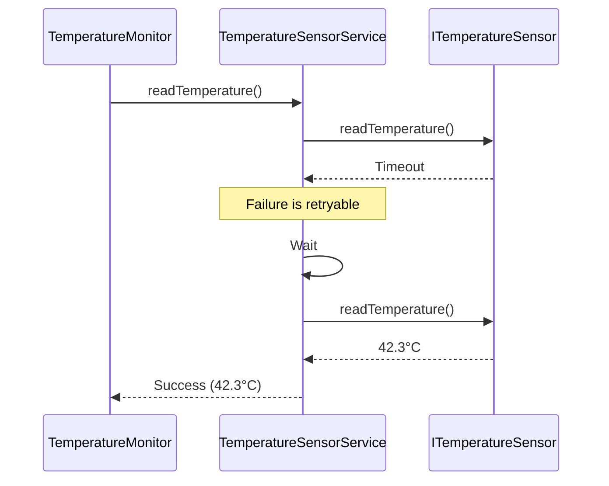
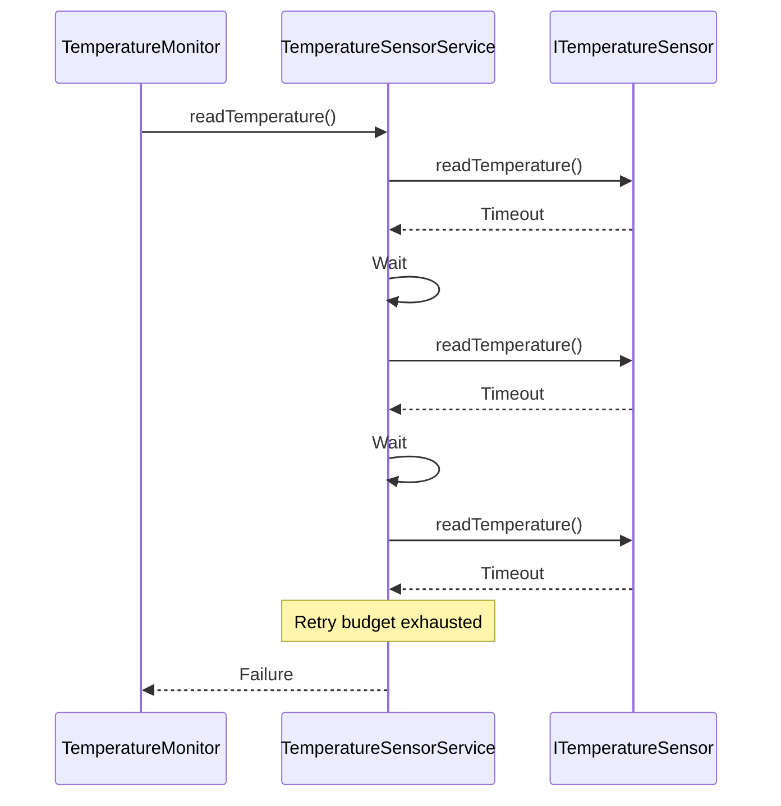

# Retry Mechanism
## Contents

- [Real Problem](#real-problem)
- [Why It Happens](#why-it-happens)
- [Architecture Solution](#architecture-solution)
- [UML Diagram](#uml-diagram)
- [CPP EXAMPLE](#cpp-example)
- [Benefits](#benefits)
- [Tradeoffs](#tradeoffs)
   
---

## Real Problem

### Problem Description

In the previous design, we introduced a **Hardware Abstraction Layer (HAL)** to isolate the `TemperatureMonitor` from the concrete temperature sensor.

Our architecture now looks approximately like this:


```mermaid
flowchart TB
    TM[TemperatureMonitor] --> ITS[ITemperatureSensor]
    TMP[TMP36 Driver] --> ITS
```
This solved an important architectural problem:

The application no longer depends directly on a specific sensor implementation.

But abstraction does not make hardware failures disappear.

Consider our **industrial temperature monitoring device**.

The system periodically:

- Reads the temperature sensor
- Processes the measurement
- Displays the temperature to the operator
- Reports the measurement to a supervisory system

During normal operation, a sensor read might occasionally fail.

For example:

```text
Read #1 → Communication Timeout
Read #2 → 42.3 °C
Read #3 → 42.4 °C
```

The first operation failed, but the sensor itself was not permanently broken.

The failure was **transient**.

Possible causes include:

- Temporary communication timeout
- Bus contention
- Electrical noise
- Sensor temporarily busy
- Short-lived communication disturbance

This creates an important architecture question:

> **Should one failed sensor read immediately put the entire monitoring system into an error state?**

Usually, not necessarily.

But blindly retrying is not a good solution either.

### Two Naive Reactions

When an operation fails, two simple implementations are common.

#### Reaction 1 - Fail Immediately

```cpp
auto result = sensor.readTemperature();

if (!result.success)
{
    enterSystemError();
}
```

The architecture effectively behaves like this:

```text
Read
  |
  ▼
Fail
  |
  ▼
System Error
```

This is simple and deterministic.

However, a temporary communication disturbance can now cause an unnecessary system-level failure.

A recoverable fault has been treated as a permanent fault.

#### Reaction 2 - Retry Forever

Another implementation may attempt to recover indefinitely:

```cpp
while (!sensor.readTemperature().success)
{
    // keep trying
}
```

Now the system behaves like:

```text
Read
  |
Fail
  |
Retry
  |
Fail
  |
Retry
  |
...
```

This creates a different reliability problem.

The software may remain stuck trying to communicate with a sensor that has actually failed.

Depending on the system architecture, this can:

- Block useful work
- Increase response latency
- Prevent higher-level fault handling
- Delay fault reporting
- Interfere with timing requirements

Neither extreme distinguishes between a **transient failure** and a **persistent failure**.

## Why It Happens

### Root Cause

The architectural problem is not simply:

> “The sensor read failed.”

Failures are expected in real embedded systems.

The deeper problem is:

> **The system has no explicit recovery policy for a failed operation.**

The sensor driver knows how to communicate with the hardware.

For example:

```cpp
sensor.readTemperature();
```

But several decisions remain unanswered:

```text
What should happen if it fails?
        |
        v
Should we retry?
        |
        v
Which failures are retryable?
        |
        v
How many attempts are allowed?
        |
        v
How long should we wait?
        |
        v
What happens when recovery fails?
```
These are not merely driver implementation details.

They are **reliability-policy decisions**.

### Transient vs Persistent Failure

A key architectural distinction is whether the failure has a reasonable chance of disappearing when the operation is attempted again.

#### Transient Failure

Example:

```text
Attempt 1 → Sensor disconnected
Attempt 2 → Sensor disconnected
Attempt 3 → Sensor disconnected
```
Additional retries do not repair the underlying fault.

This means:
> **Retry should only be applied when another attempt has a reasonable possibility of succeeding.**

This is why simply surrounding every failed operation with a retry loop is not a robust architecture.

## Architecture Solution 

### Introduce a Bounded Retry Policy

Instead of immediately failing or retrying forever, introduce an explicit bounded retry policy.

The recovery flow becomes:


```mermaid
flowchart LR
    Read[Read Sensor] --> Success{Success?}

    Success -->|Yes| Return[Return Measurement]
    Success -->|No| Retryable{Retryable?}

    Retryable -->|No| Failure[Escalate Failure]
    Retryable -->|Yes| Attempts{Attempts Remaining?}

    Attempts -->|No| Failure
    Attempts -->|Yes| Wait[Wait]

    Wait --> Read
```
The retry mechanism now makes several decisions explicitly:
1.	**Is this failure retryable?** 
2.	**How many attempts are allowed?** 
3.	**How long should the system wait between attempts?** 
4.	**What happens when all attempts fail?** 
This turns retry from an accidental loop into a deliberate reliability policy.

### Retry Should Be Selective

Not every error should trigger another attempt.

Consider:

```text
Communication timeout      → Retry may help
Sensor busy                → Retry may help
Temporary bus contention   → Retry may help

Invalid configuration      → Retry probably won't help
Unsupported command        → Retry won't help
Sensor disconnected        → Repeated immediate retries may not help
```
The exact classification depends on the device and its failure model.
Therefore, the retry mechanism needs meaningful error information from the lower layer.
Instead of an interface that can only return a temperature value:

```cpp
float readTemperature();
```
the design should communicate whether the operation succeeded and, when it failed, why it failed.

For example:

```cpp
enum class SensorError
{
    None,
    Timeout,
    Busy,
    CommunicationError,
    InvalidData,
    HardwareFault
};
```
This enables the recovery layer to make an explicit decision instead of treating every failure identically.

### Where Should Retry Live? 

Retry sits in a **Sensor Service + Retry** component between `TemperatureMonitor` and `ITemperatureSensor`.


```mermaid
flowchart TB
    TemperatureMonitor --> TemperatureSensorService
    TemperatureSensorService --> ITemperatureSensor
    TMP36Driver --> ITemperatureSensor
```
Responsibilities become:

| Component | Responsibility |
|---|---|
| `TemperatureMonitor` | Application/business behavior |
| `TemperatureSensorService` | Recovery and retry policy |
| `ITemperatureSensor` | Hardware abstraction |
| `TMP36Driver` | Hardware-specific communication |

This separation is important.

We do **not** want code such as this spread throughout application logic:

```cpp
if (sensor.readTemperature() fails)
{
    delay();
    retry();
}
```
Otherwise every application component may invent its own recovery behavior.
Instead:

```text
TemperatureMonitor
        |
        ▼
TemperatureSensorService
        |
    Retry Policy
        |
        ▼
ITemperatureSensor
        ▲
        |
    TMP36Driver
```
The application asks for a temperature measurement.
The sensor service decides how temporary failures should be handled.

### Retry Must Be Bounded 

A reliable retry policy needs an upper limit.
For example:

```text
Maximum attempts: 3
Delay:            10 ms
```

Execution might look like:

```text
Attempt 1
   |
Timeout
   |
Wait 10 ms
   |
Attempt 2
   |
Timeout
   |
Wait 10 ms
   |
Attempt 3
   |
Success
   ▼
Return measurement
```

But if all attempts fail:

```text
Attempt 1 → Fail
Attempt 2 → Fail
Attempt 3 → Fail
              |
              ▼
        Retry exhausted
              |
              ▼
     Escalate the failure
```

The important principle is:

> **Retry is recovery, not fault suppression.**

Once the recovery budget has been exhausted, the failure must become visible to the next architectural level.

### Retry Has a Timing Cost

This deserves particular attention in embedded systems.

Suppose:

```text
Sensor timeout = 20 ms
Retry delay    = 10 ms
Attempts       = 3
```
A failing sensor operation can now consume roughly:

```text
20 ms + 10 ms + 20 ms + 10 ms + 20 ms
= 80 ms
```

So increasing the retry count may improve tolerance to transient faults while simultaneously degrading **timing performance**.

That connects two of the quality attributes in this series:

```text
More retries
    |
    ├──► potentially better Reliability
    |
    └──► potentially worse Latency / Performance
```

Therefore:

> **The retry budget must fit inside the system's timing budget.**

This is exactly the kind of trade-off we want your GitHub repository to teach: the architecture decision is not simply *"use Retry."* It is *"how much recovery can this system safely afford?"*

---

### Key Architecture Principle

A well-designed retry mechanism should be:

**Selective → Bounded → Observable → Escalated**

**Selective:** retry only failures that may be transient.

**Bounded:** limit attempts and recovery time.

**Observable:** record or expose repeated failures so retry does not silently hide degradation.

**Escalated:** when the retry budget is exhausted, pass the failure to the appropriate higher-level fault-handling mechanism.

## UML Diagram 

### Purpose of the Diagram

The UML Class Diagram shows how retry behavior is separated from both:

- Application logic
- Hardware-specific sensor communication

The application does not implement retry itself.

Instead, a dedicated `TemperatureSensorService` applies the retry policy before calling the hardware abstraction.

### UML Class Diagram


```mermaid
classDiagram
    direction TB

    class TemperatureMonitor {
        +monitor()
    }

    class TemperatureSensorService {
        -ITemperatureSensor& sensor
        -RetryPolicy retryPolicy
        +readTemperature() SensorResult
    }

    class RetryPolicy {
        +uint8_t maxAttempts
        +uint32_t delayMs
        +isRetryable(error) bool
    }

    class ITemperatureSensor {
        <<interface>>
        +readTemperature() SensorResult
    }

    class TMP36Driver {
        +readTemperature() SensorResult
    }

    class MockTemperatureSensor {
        +readTemperature() SensorResult
    }

    class SensorResult {
        +bool success
        +float temperature
        +SensorError error
    }

    class SensorError {
        <<enumeration>>
        None
        Timeout
        Busy
        CommunicationError
        InvalidData
        HardwareFault
    }

    TemperatureMonitor --> TemperatureSensorService : uses
    TemperatureSensorService --> RetryPolicy : applies
    TemperatureSensorService --> ITemperatureSensor : uses

    TMP36Driver ..|> ITemperatureSensor : implements
    MockTemperatureSensor ..|> ITemperatureSensor : implements

    ITemperatureSensor --> SensorResult : returns
    SensorResult --> SensorError : contains
```
This follows the architecture shown in the **Reliability_Retry** carousel.

### Diagram Explanation

#### `TemperatureMonitor`

`TemperatureMonitor` contains the application logic.

Its responsibilities remain focused on things such as:

- Requesting a temperature measurement
- Processing the value
- Triggering alarms
- Updating the display
- Reporting measurements

It should not know:

- How many retry attempts are allowed
- Which failures are retryable
- How long to wait between retries

That keeps recovery policy out of the business logic.

#### `TemperatureSensorService`

This is the key new architectural component.

It sits between:

```text
TemperatureMonitor
        ↓
TemperatureSensorService
        ↓
ITemperatureSensor

Its responsibilities include:

Calling the sensor
Examining the returned error
Deciding whether the failure is retryable
Waiting between attempts
Limiting the number of attempts
Returning success or an exhausted failure to the application

Conceptually:

```text
readTemperature()
        ↓
    Sensor read
        ↓
      Failure
        ↓
    Retryable?

    ├── No  → Escalate
    │
    └── Yes
        ↓
    Attempts remaining?

    ├── Yes → Wait → Retry
    │
    └── No  → Escalate
```

This reflects the central decision from the carousel: **separate business logic from recovery policy.

---

#### `RetryPolicy`

`RetryPolicy` contains configuration and rules for recovery.

For example:

```cpp
struct RetryPolicy
{
    uint8_t maxAttempts;
    uint32_t delayMs;
};
```

It may also determine which failures can be retried:

```cpp
bool isRetryable(SensorError error);
```

For example:

```text
Timeout             → Retry
Busy                → Retry
CommunicationError  → Retry

InvalidData         → Do not automatically retry
HardwareFault       → Do not repeatedly retry
```
The important architectural point is that retry behavior becomes an **explicit policy**, rather than an accidental loop buried in application code.

#### `ITemperatureSensor`

This remains the HAL abstraction introduced in the previous topic.

```cpp
class ITemperatureSensor
{
public:
    virtual SensorResult readTemperature() = 0;
    virtual ~ITemperatureSensor() = default;
};
```
The retry layer still does not know whether the actual sensor is:

-TMP36
-TMP117
-A future sensor
-A test double

So the HAL continues to protect the upper layers from hardware-specific details.

#### `TMP36Driver`

TMP36Driver handles hardware communication.

Its job is to:

- Access the ADC or hardware interface
- Perform the sensor-specific operation
- Detect low-level failures
- Convert those failures into a meaningful `SensorError`

It should normally report the failure rather than decide the complete system recovery policy.

That separation is important:

```text
Driver

"What happened?"

        ↓

Sensor Service

"What should we do about it?"
```

#### `SensorResult`

A simple `float` is no longer sufficient because the retry layer needs to know whether the operation succeeded.

For example:

```cpp
struct SensorResult
{
    bool success;
    float temperature;
    SensorError error;
};
```

Example successful result:

```text
success      = true
temperature  = 42.3
error        = None
```
This allows the recovery layer to distinguish different failure types.

#### `SensorError`

The error type provides information needed for recovery decisions.

Example:

```cpp
enum class SensorError
{
    None,
    Timeout,
    Busy,
    CommunicationError,
    InvalidData,
    HardwareFault
};
```
This is important because:

> A retry mechanism cannot be selective if every failure looks identical.

## Dependency Flow

The architecture can also be viewed more simply as:


```mermaid
flowchart TB
    TM[TemperatureMonitor]
    TSS[TemperatureSensorService<br/>Retry Responsibility]
    ITS[ITemperatureSensor]
    TMP[TMP36Driver]

    TM --> TSS
    TSS --> ITS
    TMP -. implements .-> ITS
```
The important separation is:

```text
Application responsibility
        ↓
TemperatureMonitor


Recovery responsibility
        ↓
TemperatureSensorService


Hardware abstraction
        ↓
ITemperatureSensor


Hardware responsibility
        ↓
TMP36Driver
```
This gives every layer a clear reason to change.

## Retry Sequence

For the repository, I also recommend adding a small sequence diagram because retry is a **behavioral mechanism**, and the class diagram alone does not show the recovery flow very clearly.


```mermaid
sequenceDiagram
    participant TM as TemperatureMonitor
    participant TSS as TemperatureSensorService
    participant ITS as ITemperatureSensor

    TM->>TSS: readTemperature()
    TSS->>ITS: readTemperature()
    ITS-->>TSS: Timeout

    Note over TSS: Failure is retryable

    TSS->>TSS: Wait
    TSS->>ITS: readTemperature()
    ITS-->>TSS: 42.3°C

    TSS-->>TM: Success (42.3°C)
```

And the failure case:


```mermaid
sequenceDiagram
    participant TM as TemperatureMonitor
    participant TSS as TemperatureSensorService
    participant ITS as ITemperatureSensor

    TM->>TSS: readTemperature()
    TSS->>ITS: readTemperature()
    ITS-->>TSS: Timeout

    TSS->>TSS: Wait
    TSS->>ITS: readTemperature()
    ITS-->>TSS: Timeout

    TSS->>TSS: Wait
    TSS->>ITS: readTemperature()
    ITS-->>TSS: Timeout

    Note over TSS: Retry budget exhausted

    TSS-->>TM: Failure
```

This second diagram is especially useful because it shows a critical architectural principle:

> **Retry does not eliminate failure. It attempts bounded recovery and then escalates when recovery fails.**

For your GitHub article, I recommend keeping both diagrams: the class diagram explains *where responsibility lives*, while the sequence diagram explains *how retry behaves at runtime*.

At this point the retry mechanism stops.

The failure is escalated to the next architectural level.

The higher level may then decide to:

```text
Mark sensor unavailable
Trigger degraded mode
Raise diagnostic event
Notify operator
Restart subsystem
```
Those actions should not be hidden inside the retry mechanism.

## Responsibility Separation

The final design creates clear ownership:

```text
TemperatureMonitor
        |
        | What should the system do?
        v

TemperatureSensorService
        |
        | Can this operation recover?
        v

ITemperatureSensor
        |
        | How do I access the sensor?
        v

TMP36Driver
        |
        | Hardware interaction
        v

Sensor
```
This separation is important because each layer answers a different question.

| Layer | Main Question |
|---|---|
| `TemperatureMonitor` | What should the product do with the measurement or failure? |
| `TemperatureSensorService` | Should and how should this failure be retried? |
| `ITemperatureSensor` | What sensor operation is available? |
| `TMP36Driver` | How is the physical sensor accessed? |

## Architecture Evolution

This also shows how the architecture of our running product is gradually improving.

### Initial Design

```text
TemperatureMonitor
        |
        v
TMP36Driver
```
### After HAL

```text
TemperatureMonitor
        |
        v
ITemperatureSensor
        ^
        |
TMP36Driver
```
### After Retry

```text
TemperatureMonitor
        |
        v
TemperatureSensorService
        |
        v
ITemperatureSensor
        ^
        |
TMP36Driver
```
HAL solved **hardware dependency**.

Retry now addresses **transient operational failure**.

That progression is exactly the continuity we want across the series.

## Key Takeaway

The key architecture decision is not simply:

> Add a retry loop.

It is:

> **Give recovery policy a clear architectural owner.**

In this design:

```text
TemperatureSensorService
```
owns the retry decision, while:

```text
TemperatureMonitor
```
remains focused on application behavior and:

```text
TMP36Driver
```
remains focused on hardware communication.

The result is a design where retry behavior can be:

**Selective → Bounded → Observable → Escalated**

without mixing recovery logic into unrelated layers.


## CPP EXAMPLE

### Goal
The goal of this example is to demonstrate how a **bounded Retry policy** can recover from transient sensor failures without spreading recovery logic throughout the application.

In the previous HAL example, the `TemperatureMonitor` was isolated from the concrete sensor implementation through the `ITemperatureSensor` interface.

For Retry, we extend that architecture:

```text
TemperatureMonitor
        |
        v
TemperatureSensorService
        |
        v
ITemperatureSensor
        ^
        |
   TMP36Driver
```

Each component has a clear responsibility:

| Component | Responsibility |
|---|---|
| `TemperatureMonitor` | Application behavior |
| `TemperatureSensorService` | Retry and recovery policy |
| `ITemperatureSensor` | Hardware abstraction |
| `TMP36Driver` | Hardware-specific communication |
| `RetryPolicy` | Retry configuration |
| `IDelay` | Platform-independent waiting mechanism |

The important design decision is that Retry is **not implemented as an arbitrary loop inside the application or driver**.

The recovery policy has a clear architectural owner: `TemperatureSensorService`.

---

### Step 1: Represent Sensor Errors

A Retry mechanism needs to know **why** an operation failed.

```cpp
enum class SensorError
{
    None,
    Timeout,
    Busy,
    CommunicationError,
    InvalidData,
    HardwareFault
};
```

This allows the recovery layer to distinguish between potentially transient and non-retryable failures.

For example:

```text
Timeout             -> Retry
Busy                -> Retry
CommunicationError  -> Retry
HardwareFault       -> Do not retry
```

The exact classification should depend on the failure model of the real sensor and system.

---

### Step 2: Return an Explicit Sensor Result

The original HAL example returned only a temperature value.

```cpp
float readTemperature();
```

For Retry, this is not enough.

The recovery layer also needs information about whether the operation succeeded and, if not, why it failed.

```cpp
struct SensorResult
{
    bool success;
    float temperature;
    SensorError error;
};
```

A successful operation might return:

```cpp
{
    true,
    42.3f,
    SensorError::None
}
```

A failed operation might return:

```cpp
{
    false,
    0.0f,
    SensorError::Timeout
}
```

This makes failure information explicit instead of encoding failures using special temperature values.

---

### Step 3: Extend the HAL Interface

The HAL interface now returns `SensorResult`.

```cpp
class ITemperatureSensor
{
public:
    virtual SensorResult readTemperature() = 0;
    virtual ~ITemperatureSensor() = default;
};
```

The application still remains independent of the concrete sensor implementation.

The interface now additionally provides enough information for higher-level recovery decisions.

---

### Step 4: Define the Retry Policy

The Retry configuration is represented separately from the Retry algorithm.

```cpp
struct RetryPolicy
{
    std::uint8_t maxAttempts;
    std::uint32_t delayMs;
};
```

Example:

```cpp
RetryPolicy retryPolicy{
    3,
    10
};
```

This means:

```text
Maximum total attempts = 3
Delay between attempts = 10 ms
```

`maxAttempts` includes the initial operation.

Therefore:

```text
maxAttempts = 3
```

means:

```text
Attempt 1 -> Initial operation
Attempt 2 -> Retry
Attempt 3 -> Retry
```

Using `maxAttempts` instead of `numberOfRetries` avoids ambiguity about whether the initial attempt is included.

---

### Step 5: Abstract the Delay Mechanism

Waiting between Retry attempts depends on the execution environment.

A real embedded system might use:

- An RTOS delay
- A hardware timer
- A platform-specific delay API

Instead of coupling the Retry service directly to one of these mechanisms, the example introduces `IDelay`.

```cpp
class IDelay
{
public:
    virtual void waitMs(std::uint32_t milliseconds) = 0;
    virtual ~IDelay() = default;
};
```

A platform implementation can then provide the actual delay:

```cpp
class PlatformDelay : public IDelay
{
public:
    void waitMs(std::uint32_t milliseconds) override
    {
        // Replace with target-specific delay implementation.
        (void)milliseconds;
    }
};
```

For example, a real target could internally use an RTOS or MCU-specific timing function.

This also makes Retry testing easier because tests do not need to perform real delays.

---

### Step 6: Introduce the TemperatureSensorService

`TemperatureSensorService` is responsible for applying the recovery policy.

```cpp
class TemperatureSensorService
{
public:
    TemperatureSensorService(
        ITemperatureSensor& sensor,
        IDelay& delay,
        RetryPolicy retryPolicy);

    SensorResult readTemperature();

private:
    bool isRetryable(SensorError error) const;

    ITemperatureSensor& sensor_;
    IDelay& delay_;
    RetryPolicy retryPolicy_;
};
```

Its dependencies are explicit:

```text
TemperatureSensorService
        |
        +---- ITemperatureSensor
        |
        +---- IDelay
        |
        +---- RetryPolicy
```

The service knows **how recovery should be attempted**, but it does not know the hardware-specific details of the sensor.

---

### Step 7: Implement the Retry Algorithm

The core Retry logic is implemented inside `TemperatureSensorService`.

```cpp
SensorResult TemperatureSensorService::readTemperature()
{
    SensorResult result{
        false,
        0.0f,
        SensorError::HardwareFault
    };

    for (std::uint8_t attempt = 1;
         attempt <= retryPolicy_.maxAttempts;
         ++attempt)
    {
        result = sensor_.readTemperature();

        if (result.success)
        {
            return result;
        }

        if (!isRetryable(result.error))
        {
            return result;
        }

        if (attempt < retryPolicy_.maxAttempts)
        {
            delay_.waitMs(retryPolicy_.delayMs);
        }
    }

    return result;
}
```

The execution flow is:

```text
Read Sensor
     |
     v
 Success? ---- Yes ----> Return measurement
     |
     No
     |
     v
 Retryable? --- No ----> Return failure
     |
     Yes
     |
     v
Attempts remaining?
     |
     +---- No ----------> Return failure
     |
     Yes
     |
     v
    Wait
     |
     v
Retry
```

The important point is that Retry is **bounded**.

The software cannot remain indefinitely inside the Retry loop.

---

### Step 8: Retry Only Appropriate Failures

Not every failure should automatically trigger another attempt.

The example uses `isRetryable()` to classify failures.

```cpp
bool TemperatureSensorService::isRetryable(
    SensorError error) const
{
    switch (error)
    {
        case SensorError::Timeout:
        case SensorError::Busy:
        case SensorError::CommunicationError:
            return true;

        case SensorError::None:
        case SensorError::InvalidData:
        case SensorError::HardwareFault:
            return false;
    }

    return false;
}
```

For example:

```text
Timeout
    |
    v
Retry

HardwareFault
    |
    v
Do not retry
    |
    v
Return failure
```

This prevents the system from wasting its Retry budget on failures where another immediate attempt is unlikely to help.

Retry is therefore **selective**, not automatic for every error.

---

### Step 9: Keep Retry Out of the Application

`TemperatureMonitor` uses `TemperatureSensorService`.

```cpp
void TemperatureMonitor::monitor()
{
    SensorResult result =
        sensorService_.readTemperature();

    if (!result.success)
    {
        handleSensorFailure(result.error);
        return;
    }

    // Process valid measurement...
}
```

Notice what the application does not contain:

```text
Retry counters
Retry loops
Delay handling
Transient-error classification
```

The application asks for a measurement.

The service handles operation-level recovery.

If recovery fails, the failure is returned to the application for higher-level handling.

---

### Step 10: Connect the Components

The concrete components are connected in `main.cpp`.

```cpp
int main()
{
    TMP36Driver sensor;

    PlatformDelay delay;

    RetryPolicy retryPolicy{
        3,
        10
    };

    TemperatureSensorService sensorService(
        sensor,
        delay,
        retryPolicy);

    TemperatureMonitor monitor(
        sensorService);

    monitor.monitor();

    return 0;
}
```

The resulting dependency structure is:

```text
TemperatureMonitor
        |
        v
TemperatureSensorService
        |
        +------ RetryPolicy
        |
        +------ IDelay
        |          ^
        |          |
        |     PlatformDelay
        |
        v
ITemperatureSensor
        ^
        |
   TMP36Driver
```

`main()` acts as the **composition root** where the concrete dependencies are created and connected.

---

### Testing Transient Failures

Because the service depends on `ITemperatureSensor`, a test implementation can simulate failures without real hardware.

For example:

```cpp
class MockTransientFailureSensor
    : public ITemperatureSensor
{
public:
    SensorResult readTemperature() override
    {
        ++attemptCount_;

        if (attemptCount_ < 3)
        {
            return {
                false,
                0.0f,
                SensorError::Timeout
            };
        }

        return {
            true,
            42.3f,
            SensorError::None
        };
    }

private:
    std::uint8_t attemptCount_{0};
};
```

The simulated execution becomes:

```text
Attempt 1 -> Timeout
Attempt 2 -> Timeout
Attempt 3 -> 42.3 C
```

The operation succeeds within the configured Retry budget.

This demonstrates the main purpose of Retry:

> Recover automatically when a failure is temporary.

---

### Testing Persistent Failures

A different test sensor can simulate a persistent timeout.

```cpp
class MockPersistentFailureSensor
    : public ITemperatureSensor
{
public:
    SensorResult readTemperature() override
    {
        return {
            false,
            0.0f,
            SensorError::Timeout
        };
    }
};
```

With:

```text
maxAttempts = 3
```

the behavior becomes:

```text
Attempt 1 -> Timeout
Attempt 2 -> Timeout
Attempt 3 -> Timeout
              |
              v
      Retry budget exhausted
              |
              v
        Return failure
```

The Retry mechanism does not block indefinitely.

The failure becomes visible to the higher architectural layer.

---

### Testing a Non-Retryable Failure

A test sensor can also simulate a permanent hardware fault.

```cpp
class MockHardwareFailureSensor
    : public ITemperatureSensor
{
public:
    SensorResult readTemperature() override
    {
        return {
            false,
            0.0f,
            SensorError::HardwareFault
        };
    }
};
```

Because `HardwareFault` is classified as non-retryable:

```text
Attempt 1
    |
HardwareFault
    |
    v
No Retry
    |
    v
Return failure
```

Even when `maxAttempts` is configured as `3`, only one operation is attempted.

This demonstrates that a good Retry policy is **selective as well as bounded**.

---

### Source Code Structure

The example is divided into small components with clear responsibilities.

```text
src/
├── SensorError.h
├── SensorResult.h
├── RetryPolicy.h
├── ITemperatureSensor.h
├── IDelay.h
├── TMP36Driver.h
├── PlatformDelay.h
├── TemperatureSensorService.h
├── TemperatureSensorService.cpp
├── TemperatureMonitor.h
├── TemperatureMonitor.cpp
└── main.cpp
```

Test doubles are kept separately:

```text
tests/
├── MockDelay.h
├── MockTransientFailureSensor.h
├── MockPersistentFailureSensor.h
└── MockHardwareFailureSensor.h
```

This structure reflects the architecture itself:

```text
Application behavior
        |
        v
TemperatureMonitor

Recovery policy
        |
        v
TemperatureSensorService

Recovery configuration
        |
        v
RetryPolicy

Hardware abstraction
        |
        v
ITemperatureSensor

Hardware implementation
        |
        v
TMP36Driver
```

---

## Building the Example

A `Makefile` is provided in the root directory.

The project structure is:

```text
Retry/
├── Makefile
├── src/
└── tests/
```

The Makefile uses `g++` and C++17.

Compiler warnings are enabled using:

```text
-Wall -Wextra -Wpedantic
```

### Build

Run:

```bash
make
```

This compiles the source files and creates:

```text
build/retry_example
```

---

### Build and Run

Run:

```bash
make run
```

This builds the executable if required and then executes:

```text
build/retry_example
```

---

### Debug Build

Run:

```bash
make debug
```

The debug build uses:

```text
-g -O0
```

This includes debugging information and disables optimization, making the executable easier to inspect with a debugger.

---

### Release Build

Run:

```bash
make release
```

The release build adds:

```text
-O2 -DNDEBUG
```

to create an optimized build.

---

### Clean Build Files

Run:

```bash
make clean
```

This removes the complete `build/` directory and generated files.

---

### Display Available Targets

Run:

```bash
make help
```

Available targets are:

```text
make          Build the example
make run      Build and run the example
make debug    Build with debug information
make release  Build optimized version
make clean    Remove generated build files
make help     Display available targets
```

---

### Makefile

The example uses the following Makefile:

```makefile
CXX := g++

CXXFLAGS := -std=c++17 -Wall -Wextra -Wpedantic

SRC_DIR := src
BUILD_DIR := build

TARGET := $(BUILD_DIR)/retry_example

SOURCES := \
	$(SRC_DIR)/main.cpp \
	$(SRC_DIR)/TemperatureSensorService.cpp \
	$(SRC_DIR)/TemperatureMonitor.cpp

OBJECTS := $(SOURCES:$(SRC_DIR)/%.cpp=$(BUILD_DIR)/%.o)

all: $(TARGET)

$(TARGET): $(OBJECTS)
	$(CXX) $(CXXFLAGS) $(OBJECTS) -o $(TARGET)

$(BUILD_DIR)/%.o: $(SRC_DIR)/%.cpp
	@mkdir -p $(BUILD_DIR)
	$(CXX) $(CXXFLAGS) -I$(SRC_DIR) -c $< -o $@

run: $(TARGET)
	./$(TARGET)

debug: CXXFLAGS += -g -O0
debug: clean $(TARGET)

release: CXXFLAGS += -O2 -DNDEBUG
release: clean $(TARGET)

clean:
	rm -rf $(BUILD_DIR)

help:
	@echo "Available targets:"
	@echo "  make          Build the example"
	@echo "  make run      Build and run"
	@echo "  make debug    Build with debug information"
	@echo "  make release  Build optimized version"
	@echo "  make clean    Remove generated files"
	@echo "  make help     Show available targets"

.PHONY: all run debug release clean help
```

> **Note:** Commands under Makefile targets must begin with a tab character, not spaces.

---

### Why This Example Is Intentionally Simple

The implementation deliberately avoids:

- Dynamic memory allocation
- Exceptions
- Complex templates
- Generic Retry frameworks
- Unnecessary runtime abstractions

The purpose is not to build a universal Retry library.

The purpose is to demonstrate an architectural decision:

> **Separate application behavior, hardware access, and recovery policy.**

For a resource-constrained embedded system, a small statically configured Retry mechanism may be more appropriate than a highly generic framework.

---

### Key Takeaway

The implementation turns Retry from an arbitrary loop into an explicit recovery policy.

```text
Failure
   |
   v
Is it retryable?
   |
   v
Is recovery budget available?
   |
   v
Retry
   |
   +---- Success ------> Continue
   |
   +---- Exhausted ----> Escalate
```

The resulting design keeps Retry:

**Selective -> Bounded -> Observable -> Escalated**

In this example, the implementation demonstrates the **selective**, **bounded**, and **escalation** aspects directly.

Observability can be added through diagnostic counters, logging, or telemetry so that repeated retries do not silently hide a degrading sensor or communication path.


## Benefits 

## Tradeoffs 

### Trade-off Summary

### Key Takeaway

